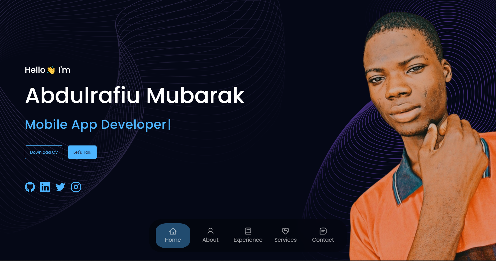

# Mubarak Abdulrafiu Portfolio


# Personal Portfolio



## Overview

Welcome to my personal portfolio website built with React, featuring animations powered by the AOS library and email functionality integrated using EmailJS. This portfolio showcases my skills, projects, and provides a way to contact me. Feel free to explore and get in touch!

## Table of Contents

- [Features](#features)
- [Technologies](#technologies)
- [Getting Started](#getting-started)
- [Usage](#usage)
- [Contributing](#contributing)
- [License](#license)

## Features

- **Interactive Design:** The portfolio is designed to be visually appealing and user-friendly, with smooth animations powered by the AOS library to engage visitors.

- **Project Showcase:** Display your projects, work experience, and skills to highlight your expertise and accomplishments.

- **Contact Form:** An integrated contact form powered by EmailJS allows visitors to send you messages directly from the portfolio.

- **Responsive:** The portfolio is designed to be responsive and adapt to various screen sizes and devices.

## Technologies

- **React:** The portfolio is built with React, a popular JavaScript library for building user interfaces.

- **AOS Library:** AOS is used for animating elements on scroll, adding a dynamic touch to the portfolio.

- **EmailJS:** EmailJS is used for the contact form to send emails directly from the portfolio.

## Getting Started

To get a copy of this project up and running on your local machine, follow these steps:

1. Clone the repository:

   ```bash
   git clone https://github.com/binary-tech001/MyPortfolio.git
